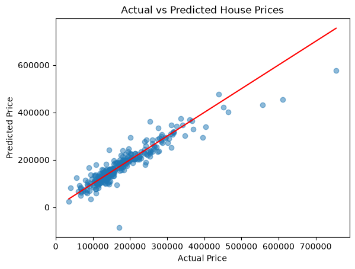

# House Price Prediction using Linear Regression

## Objective

The objective of this project is to build a Linear Regression model that predicts house sale prices based on property features, using Python and scikit-learn. The workflow covers handling missing values, encoding categorical features, training the model, and evaluating its performance.

## Dataset

The dataset used is `train.csv` (the Ames Housing dataset), containing 1460 house records with 81 features covering lot details, building characteristics, quality ratings, and sale information, with `SalePrice` as the target variable.

## Data Cleaning

Missing values were handled in two different ways depending on what the missing value actually meant:

- **Missing means the feature doesn't exist** — columns like `PoolQC` (1453 missing), `MiscFeature` (1406 missing), `Alley` (1369 missing), `Fence` (1179 missing), `FireplaceQu`, and the garage/basement quality columns were missing because most houses simply don't have that feature (no pool, no alley access, no fence, etc.). These were filled with `'None'` rather than dropped or statistically imputed, since the missing value itself carries meaning.
- **Genuinely missing data** — the remaining gaps were filled based on what made sense for each column:
  - `LotFrontage` → filled with the median
  - `GarageYrBlt` → filled with 0 (no garage means no build year)
  - `MasVnrArea` → filled with 0
  - `Electrical` → filled with the mode (only 1 row was missing)

After these steps, the dataset had zero missing values.

Categorical columns were then one-hot encoded using `pd.get_dummies(drop_first=True)`, which expanded the feature set from 80 to 260 columns.

## Model Training

The data was split 80/20 into training and testing sets (`train_test_split`, `random_state=42`), giving 1168 training rows and 292 testing rows. A `LinearRegression` model from scikit-learn was trained on the training set and evaluated on the held-out test set.

## Results

| Metric | Value |
|---|---|
| MAE | ~$20,282 |
| MSE | ~1,107,892,535 |
| RMSE | ~$33,285 |
| R² | 0.856 |

The model explains about 86% of the variance in sale prices. On average, predictions are off by around $20K (MAE), but the RMSE being noticeably higher than the MAE suggests a small number of predictions are much further off than the rest — likely outliers or houses with unusual feature combinations.

**Actual vs. Predicted Prices** — most points for lower-priced houses (under $300K) sit close to the red "perfect prediction" line, meaning the model handles these well. Houses above $400K are more scattered and tend to fall below the line, meaning the model tends to underestimate expensive homes. One clear outlier stands out: a house with an actual price around $170K was predicted to have a **negative** price, which is unrealistic and shows a weak spot in the model for houses with unusual characteristics.

## Key Insights

- The model performs well as a baseline, explaining ~86% of the variance in house prices.
- Prediction accuracy is strongest for lower and mid-priced houses; it gets noticeably weaker for high-priced homes, which the model consistently underestimates.
- Filling in "meaningful" missing values (e.g., no pool, no garage) as `'None'` instead of dropping those columns preserved useful information that a plain drop would have thrown away.
- Linear Regression struggled with at least one case badly enough to predict a negative price, which points to the limits of a purely linear model on this kind of data.

## Conclusion

This project used Linear Regression to predict house sale prices from the Ames Housing dataset. After cleaning the missing values and encoding categorical features, the model achieved an R² of 0.86 on the test set, showing it captures the overall pricing trend well but loses accuracy at the high end of the market. This suggests that regularized models (Ridge/Lasso) or non-linear approaches like tree-based models could improve performance for higher-priced homes.

## Tools Used

- Python
- Pandas
- NumPy
- Matplotlib
- scikit-learn

## How to Run

1. Clone this repository.
2. Make sure you have `pandas`, `numpy`, `matplotlib`, and `scikit-learn` installed.
3. Open the notebook in Jupyter Notebook or VS Code and run all cells.
